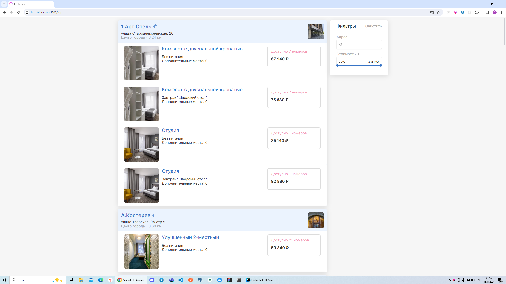
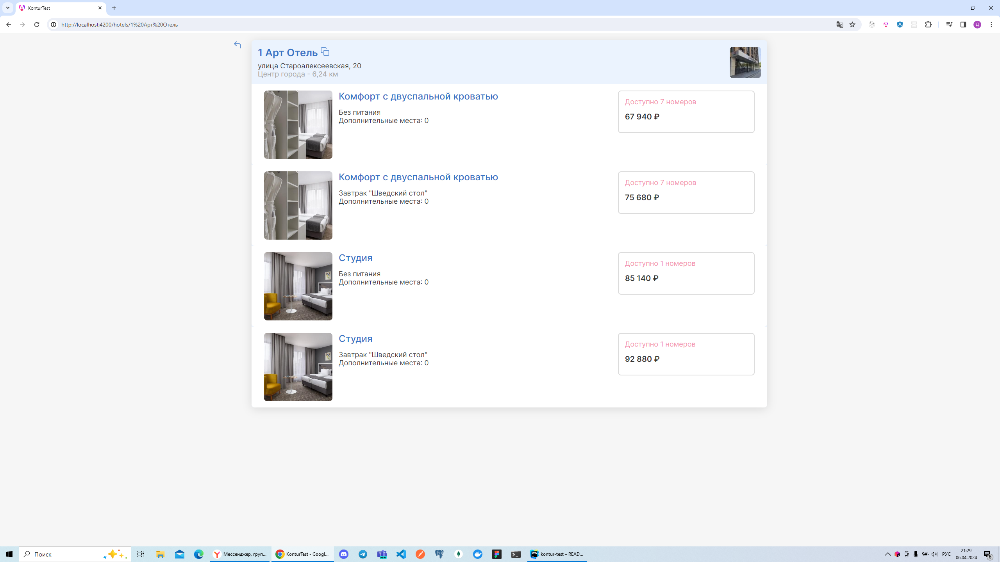
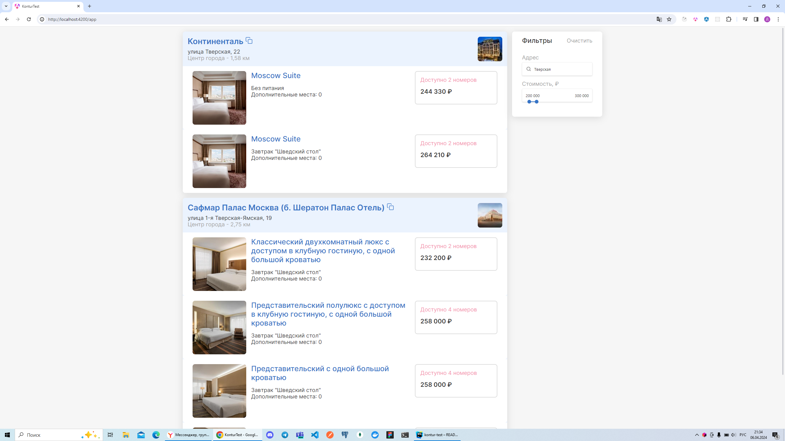

# KonturTest

Тестовое задание в Контур.

### Описание проекта

Приложение представляет собой сервис командировок в котором пользователи могут искать отели, смотреть варианты номеров и делиться своими результатами поиска.

Для поиска отелей можно использовать фильтры по адресу и стоимости.

### Запуск приложения

Выполните `npm run start-all` в терминале и перейдите по адресу `http://localhost:4200/`.

### Запуск unit-тестов

Выполните `npm run test` в терминале для запуска unit-тестов с помощью [Karma](https://karma-runner.github.io).

### Технологии

- angular 17
- rxjs
- ts
- [Taiga ui](https://taiga-ui.dev/) (uikit)
- jasmine, Karma (unit-тесты)
- json-server

### Демо

1) Список отелей в алфавитном порядке

2) Информация об одном отеле

3) Фильтрация по адресу и стоимости номера

4) Видео демонстрация

