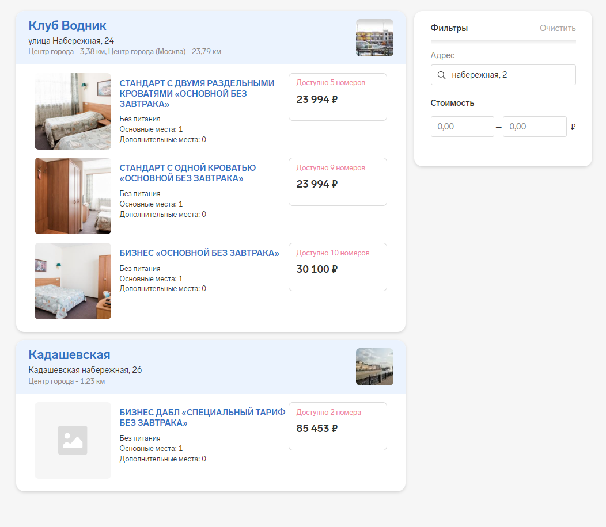
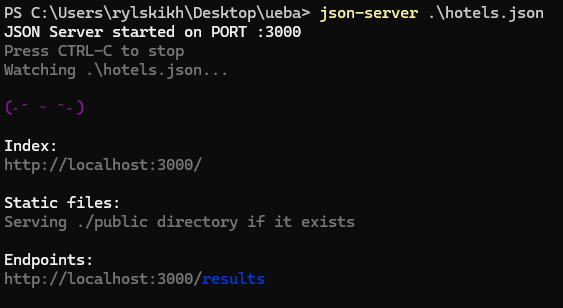

 # задание

К тебе пришла дизайнер Даша с макетом новой задачи.
В сервисе Командировок пользователи хотят искать отели, смотреть варианты номеров. Нужно дать такую возможность.
Ещё пользователям очень нужно делиться своими результатами поиска. Ниже приведен скрин того как они хотят, чтобы это выглядело. Также пользователи не хотят видеть много отелей одним списком им достаточно 10. Для поиска отелей им достаточно всего лишь фильтров по названию и цене

### Требования к отображению списка:

- Каждая карточка отеля должна отображать необходимую для пользователя информацию: название отеля, удаленность от центра города, адрес и фотографию
- Каждый вариант проживания должен отражать основную для номера информацию: название номера, питание, количество дополнительных мест, стоимость, количество свободных номеров данного типа и фотографию. 
- Максимальное количество отелей на экране не должно превышать 10, если их больше, то просто не показываем
- Сортировка отелей должна быть по названию отеля в алфовитном порядке

### Требования к фильтрации:

- Пользователь может фильтровать отели: по адресу и стоимости
- Список отелей должен обновляться в соответствии с выбранными фильтрами, по мере ввода значений. 

PS. Так как макеты это всего лишь скрин, то точных значений отступов, цветов, размеров и шрифтов нигде нет, можешь использовать примерные или похожие. Контролы, которые там есть, тоже кастомные, так что используй на свое усмотрение.

### Инструкция по настройке

[hotels.json](./hotels.json) - json файл с данными о отелях

Предлагаю поставить [json-server](https://www.npmjs.com/package/json-server) (глобально или локально это не важно, главное иметь апи к которому можно постучаться чтобы взять эти данные)

Оно вот так запускается и можно получать данные об отелях

### Технологии

- angular 15 +
- rxjs
- ts
- uikit (какой захочешь, если нужен)
- json-server (или его аналоги)
